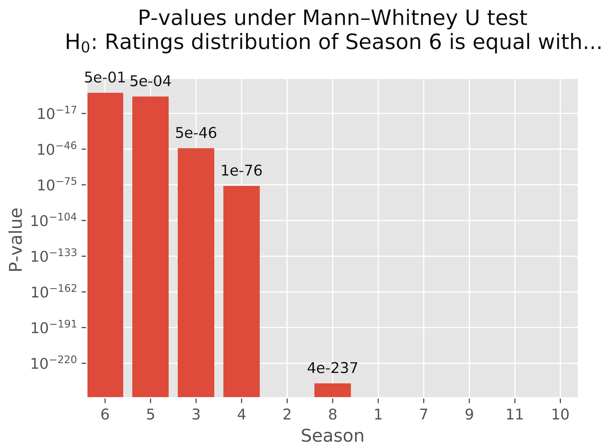

# The X-Files: Insights from Data

### Companion web app: <a href="https://tjs-xfiles.herokuapp.com">The X-Files Ratings Predictor</a> 

## Introduction

The X-Files is a popular science fiction TV show that ran mostly through the 90s, ending in 2002 and then revived briefly in 2018. While generally considered a good show, like most other shows, its quality varied across its lifetime. As a fan myself, I thought it'd be interesting to use statistical and data science techniques to analyse attributes contributing to its varying quality. E.g., when does the show peak? What factors contribute to episode rating in terms of the writer, director, character, etc.? I scraped all ratings from IMDB.com for every episode, data such as the writer and director credits and episode category ("Mythology" or not) from Wikipedia, and episode transcripts from http://www.insidethex.co.uk/ and put together a dataset to analyze and answer these questions. There is some additional data not (yet) used, like the plot summary for each episode as scraped from Wikipedia. This may be used somehow in the future to augment this project.

These are the number of scraped ratings:

<table border="0" class="dataframe">  <thead>    <tr style="text-align: right;">      <th>Season</th>      <th>No. of ratings</th>    </tr>  </thead>  <tbody>    <tr>      <td>1</td>      <td>103765</td>    </tr>    <tr>      <td>2</td>      <td>82297</td>    </tr>    <tr>      <td>3</td>      <td>74496</td>    </tr>    <tr>      <td>4</td>      <td>67279</td>    </tr>    <tr>      <td>5</td>      <td>53681</td>    </tr>    <tr>      <td>6</td>      <td>56950</td>    </tr>    <tr>      <td>7</td>      <td>50220</td>    </tr>    <tr>      <td>8</td>      <td>40793</td>    </tr>    <tr>      <td>9</td>      <td>37317</td>    </tr>    <tr>      <td>10</td>      <td>34090</td>    </tr>    <tr>      <td>11</td>      <td>24644</td>    </tr>  </tbody></table>

The core dataset used in this project is located in this directory as table_base.csv. The code to analyze the data and generate figures is in figures.ipynb (except for the 3D surface plots, which are generated from surface_figures.py). Episode transcripts are in the 'scripts' directory. 

## Ratings: first look

The mean rating per episode follows a noisy trajectory through the course of the series, but a couple of rudimentary modelling techniques shows a parabolic trajectory in which the series's ratings initially rise and peak near season 6 before declining. The following figure shows the mean rating per episode, as well as a second-order polynomial fitting and LOWESS (a moving average method) applied to the data:

  

   
  

  
  Likewise, a violin plot shows a narrowing of the ratings distribution near the top end of the scale near season 6 before widening towards the end of the series:

  

   
  

A simpler representation may be to take the average ratings per season, again showing the peak at season 6, which rests only slightly above season 5:

  

   
  

## Ratings distribution comparisons

Now we apply formal statistical tests to answer questions of whether season 6 is the best season (as apparently indicated by the previous plots) and how to rank the seasons. We will pair-wise compare seasons with the null hypothesis that their ratings distributions are equal. The figures below show the results of testing this hypothesis for seasons 5 and 6 with Welch's t-test (left), as well as for comparing season 6 with all of the seasons using the Mann-Whitney u-test (right):

<table>
<tr>
  <td></td>
  <td></td>
</tr>
</table>

The p-value for Welch's t-test, at 0.055, barely passes a commonly used rejection threshold of 0.05, which would indicate that the distributions are equal. However, the results from the Mann-Whitney u-test differ substantially for the season 5 and 6 comparison (p-value = 0.0005). The comparisons drop sharply towards zero in the order given in the bar chart. Why is there a difference between Welch's t-test and the Mann-Whitney u-test for the season 5 and 6 comparison? Welch's t-test may be unsuitable because it assumes that the distributions used for the test are normal, while the Mann-Whitney u-test is insensitive to the type of distribution. Referencing the violin plot above as well as the following KDE plot for seasons 5 and 6 shows that the ratings distributions are highly skewed:

  

   
  

Therefore, we conclude from the Mann-Whitney u-test that season 6 is higher rated than season 5. Also, using season 6 as the reference point, we could infer a season ranking of 6>5>3>4>8>the remaining seasons (the remaining seasons are uncertain due to computed p-values of zero). 

## Gaussian-smoothed ratings curve

*The code for the following four figures is in surface_figures.py*

Are there other ways of modelling the ratings progression than those given in the first figure on this page (second order polynomial and a moving average on the mean rating)? I drew an idea from KDE (kernel density estimation) plots, which estimate a contiuous probability distribution from overlapping Gaussian curves: the curves are centered on the corresponding points on the horizontal axis and overlap to give the overall distribution (see an example on <a href="https://en.wikipedia.org/wiki/Kernel_density_estimation">Wikipedia</a>). I thought I'd do a multivariate KDE with 'episode' on the x-axis and 'rating' on the y-axis, hoping that the overlapping Gaussian curves would give a smooth progression of ratings probabilities across the series. The following figures are the resulting contour plot and surface plot (<a href="http://tjs-xfiles.herokuapp.com/static/surface_fig.html" target="_blank">click here</a> for an interactive version):

  

   
  

  

   
  

To obtain a reasonably smooth progression, I assigned <i>σx2</i> as 36 (that is, the standard deviation covers 6 episodes on the x-axis) and <i>σy2</i> as 1.0 (1 unit in the ratings direction (y-axis)). Now it's possible to see a slightly more informative progression than the first figure. If we walk along the highest point of the surface across the x-axis, we traverse what I'll call the "Ratings Ridge", the highest probability rating across the series:

  

   
  

  

   
  

What kind of interesting insights could we get from this? I noticed some bumps in curve centered around the beginning of each season. Does that mean there are better episodes in the show near the beginning and end of each season? 

  <table>
  <tr>
    <td></td>
    <td></td>
  </tr>
  </table>

Taking the ratings distribution of episodes in the outer and inner halves of each season, the answer according to the Mann-Whitney U-test is *yes* (p-value = 0.0 under the null hypothesis that the distributions are equal). 

## Words spoken by character

*Note: analysis from here onwards is only through season 9*

Part of the data acquisition was scraping and cleaning transcripts for the series. (Though, currently I only have through the end of season 9 due to the availability of transcript data.) This enables me to show a word count for every character -- some important characters are used for this in the plots below:

  <table>
  <tr>
    <td></td>
    <td></td>
  </tr>
  </table>

The bar chart shows the large number of total words for Scully and Mulder compared to everyone else (unsurprisingly), though perhaps more interesting is that Mulder usually speaks more in each episode than Scully, as indicated in the scatter plot on the right. (The scatter plot shows both the raw word count and a smoothed line as the faded and darker lines, respectively.) There's a drop in Mulder's word count at season 8 when David Duchovney leaves the regular cast of the show, reappearing only sporadically. 

Extracting deeper insights from word count as related to the show quality for any character is a little tricky, though a very slight correlation with mean rating appears for the Cigarette-Smoking Man, as will be seen below.

## Correlation of individual variables with rating

Together with word count data, the following numerical data were used to find correlations with mean episode rating:

- One-hot encoded: writer, director, category (mythology or not)  
- Viewers (millions)

The following figure shows the variables with the top R2 value with mean rating (a charactor in capital letters is a variable that denotes that charactor's word count):

  

   
  

Plots of the variables with the top 4 R2 values, as well as those for Mulder and Scully's word count, are shown below (Mulder and Scully were also included purely out of interest):

<table>
  <tr>
    <td></td>
    <td></td>
    <td></td>
  </tr>
  <tr>
    <td></td>
    <td></td>
    <td></td>
  </tr>
  </table>
  
Looking at characters' word counts considered here, there seems to be no correlation with episode rating, except for CSM, which is very slight. Stronger correlations are shown for the other (dummy-encoded) variables. The strongest correlation is for 'Mythology'. 

We can apply statistical tests to determine whether these analyses satisfy the assumptions of linear regression. Specifically, we can test normality of the residuals and homoscedasticity using the Shapiro-Wilk test and White test, respectively. The following table shows the p-values for these tests as well as the R2 values for several of the variables with the highest correlation with mean rating:

  

   
  

  
  The shades of green are relative to the highest value in each column. Homoscedasticity and normality of residuals could be indicated by p-values exceeding e.g. 0.05. The best linear regression is clearly with that of the Mythology variable, though it doesn't satisfy homoscedasticity, as the variances in distribution between the two populations are obviously unequal. Despite this, it's still clear that Mythology episodes are higher rated. See the following KDE plot for the ratings distributions of each episode category (Mythology or not):
  
  

   
  

  
## P-value-weighted ranking of Writers, Directors, and Characters
  
  Here we'll examine the ratings distribution of the show with and without a writer, director or character present. Writers or directors are deemed present by being in the episode credits, and characters are deemed present by speaking at least one word. The following plots show the variables with the highest difference in mean rating in each of the three categories, as well as the p-value computed by the Mann-Whitney U-test to test whether the ratings distributions are equal.   
  
  <table>
  <tr>
    <td></td>
    <td></td>
    <td></td>
  </tr>
  </table>

The lighter the dot, the more confidence there is that the difference in mean rating is true for that variable. In the plot for characters, some characters (Doggett and Reyes) have negative differences and p-values greater than 1, where it would be more appropriate to test the confidence that the show is higher-rated *without* those characters (ouch!) and take 1 - the p-value. Some variables have considerably high effects on the ratings mean, but the confidence in their effect doesn't necessarily correspond with the value. Therefore, it may be useful to do some sort of weighting using the p-value. If we, e.g., multiply the absolute mean ratings difference by the negative logarithm of the p-value (which would give higher weight for lower p-values), we get the following:

  <table>
  <tr>
    <td></td>
    <td></td>
    <td></td>
  </tr>
  </table>

Now the ordering is changed considerably from the previous set of plots, and a few remarks could be made: Among the writers, Darin Morgan, Vince Gilligan, and Chris Carter seem to be among the most important writers, judging from the steep drop in the computed value to the following writers. The same is true for R.W. Goodwin in the directors' plot. Among the characters, it is particularly clear that CSM had a positive effect on the show's ratings. The following characters follow a more gradual descent, and perhaps interestingly, Krycek and Skinner are ranked pretty highly, behind CSM. The formula used here is not necessarily the best way to use the Mann-Whitney U-test p-value to weight the mean ratings difference though; this is something that could be explored further. 

## <a href="https://tjs-xfiles.herokuapp.com">Experimental web app</a>

Using the dataset for seasons 1-9 with character word count and one-hot encoded writer, director, and Mythology variables, I created a web app that predicts a user's episode ratings: given ratings for selected episodes, the app predicts the user's ratings for the rest of the series (through season 9). It works by fitting an XGBRegressor model to the user's ratings and using that model to predict the other ratings. It's currently being tuned and tested, but is fun to experiment with for the time being.

